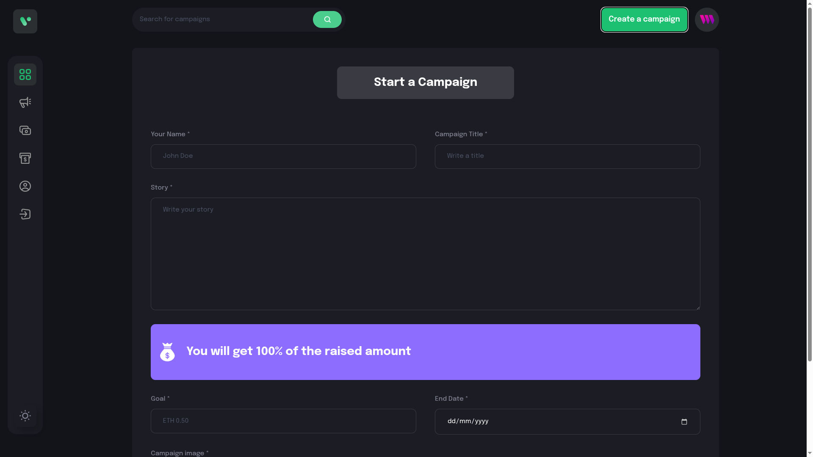
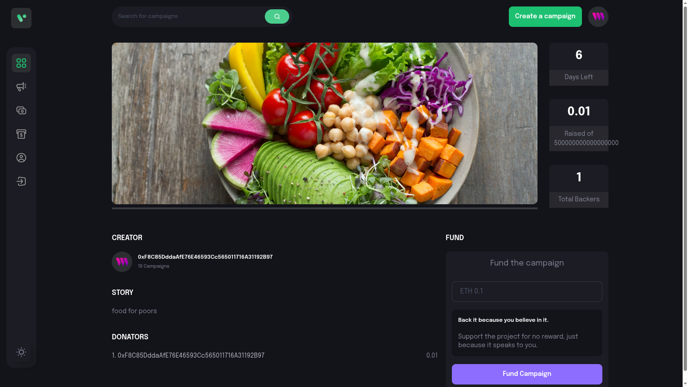

# 🚀 Decentralized Crowdfunding Platform

A **transparent, trustless, and blockchain-powered crowdfunding application** built on **Ethereum Sepolia**, enabling users to create fundraising campaigns, donate securely, and track progress on-chain — without intermediaries.

---

## 📸 Application Screenshots


  
*Browse Active Campaigns*

  
*Launch Your Own Fundraiser*

  
*Track Donations in Real Time*

  
*Manage Your Created Campaigns*

---

## 🌟 Features

✅ Create fundraising campaigns  
✅ View all campaigns on the platform  
✅ Donate ETH securely using MetaMask  
✅ Track total amount raised & donors  
✅ View campaigns created by the connected wallet  
✅ Fully decentralized — data stored on-chain  
✅ Deployed on Sepolia testnet for easy testing

---

## ⚙️ Tech Stack

| Layer | Technology |
|--------|------------|
| **Smart Contracts** | Solidity |
| **Web3 SDK** | Thirdweb |
| **Blockchain** | Ethereum Sepolia Testnet |
| **Frontend** | React, Vite, TailwindCSS |
| **Wallet** | MetaMask |
| **Interaction** | Thirdweb SDK |

---

## 🧠 Smart Contract

📍 **Deployed Contract Address (Sepolia):**  
`0x354b650224F78084A8EC08040ACCD65A548654a0`

### Contract Functions

| Function | Description |
|----------|--------------|
| `createCampaign()` | Create a new fundraising campaign |
| `getCampaigns()` | Retrieve all campaigns |
| `donateToCampaign()` | Donate ETH to a campaign |
| `getDonators()` | Fetch donors & donation amounts |

---

## 🚀 Getting Started

###  1. Clone the Repository
```bash
git clone <your-repo-url>
cd crowdfunding-platform
```

###  2. Install Dependencies
```bash
npm install
```

###  3. Configure Environment Variables
```bash
VITE_THIRDWEB_CLIENT_ID=your_thirdweb_client_id
```

###  4. Run the App
```bash
npm run dev
```


## 🎯 How to Use

1️⃣ Connect MetaMask wallet  
2️⃣ Create a campaign with required details  
3️⃣ Browse all available campaigns  
4️⃣ Donate ETH directly on-chain  
5️⃣ Track fundraising progress in real time  
6️⃣ Visit Profile to see your campaigns

---

## 🔐 Security

- Smart contract verified on-chain  
- Funds go directly to campaign owner — no intermediaries  
- Transparent donation records  
- Immutable campaign data stored on blockchain

---

## 🐛 Known Issues

- Console may show Thirdweb analytics 401 (safe to ignore)  
- User must manually switch MetaMask network to Sepolia

---


## 🤝 Contributing

Contributions welcome! 🎉

1. Fork the repo  
2. Create a feature branch  
3. Commit your changes  
4. Push and open a Pull Request ✅

---

## 📄 License

This project is licensed under the **MIT License**.

---

## 👨‍💻 Developer

Built with ❤️ by **[rahul]**

- GitHub: `https://github.com/rahul-0407/crowd-funding`  
- LinkedIn: `your-profile` 
- Live: '`https://fund0.vercel.app/` 

---

